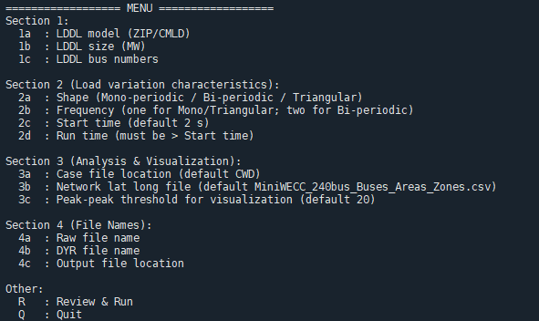

# LL-risk-assessment
A suite of scripts that helps evaluate and visualize the grid reliability risk due to oscillations introduced by large dynamic digital loads (LDDLs) at the planning stage.

To cite this work, please use "Biswas, Shuchismita, Antos C. Varghese, Kaustav Chatterjee, Sameer Nekkalapu, Brett Ross, and Jim Follum. "Evaluating the Risk to Bulk Power System Reliability from Large Load Induced Oscillations." Authorea Preprints (2025)."https://www.techrxiv.org/doi/full/10.36227/techrxiv.175623878.87007943

## Introduction
The structure of suite of scripts are detailed below.
```text
├─ main_smaart.py              # Main code 
├─ scenario_menu.py            # Setting command line interface options
├─ LDDL_Different_Load_Variations.py               # Different periodic load variation patterns
├─ LDDL_Viz_Functions.py       # Oscillation risk evaluation and visualizations
├─ requirements.txt            # PSS/E, Python and Folder locations requirements
└─ README.md
```

When the main file "main_smaart.py" is run, the user is presented with options as shown in figure below.
.


<p align="justify"> The options are divided into four sections. In the first section the user has the flexibility to select the size and location of the LDDL. Second section provides options to choose the type of load variation - monoperiodic, biperiodic, or triangular - along with their corresponding parameters. Note that a default option is always avilable in case the user choose not to change anything. In the third section, the user can provide a fiel describing Latitude-Longitude data of the network used for visualization (option 3b). The peak-peak MW threshold for risk evaluation can be modified using option 3c. Finally, section 4 provides option to do analysis for a new test system (default is 240 bus WECC system) by selection appropriate PSS/E raw and dyr files using options 4a and 4b respectively. The tool provides two outputs - the visualization figure showing the critical transmission lines and an output csv file containing the LDDL load variation data generated using PSS/E. The location for saving the files can be modified by updating option 4c.</p>
