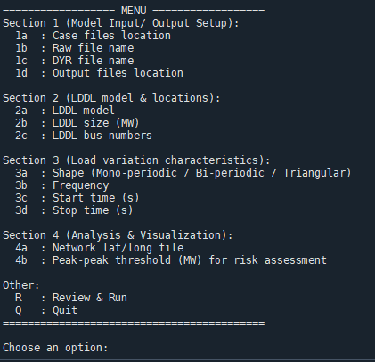

# LL-risk-assessment
A suite of scripts that helps evaluate and visualize the grid reliability risk due to events introduced by large dynamic digital loads (LDDLs) at the planning stage.

## Introduction
The structure of suite of scripts are detailed below.
```text
├─ main_smaart.py              # Main code 
├─ scenario_menu.py          # Setting CLI options
├─ LDDL_Different_Load_Variations.py               # Different types of relistic load variations of LDDLs
├─ LDDL_Viz_Functions.py     # Oscillations analysis and visualizations
├─ requirements.txt     # PSS/E, Python and Fodler locations requirements
└─ README.md
```

When the main file "main_smaart.py" is run, the user is presesnted with options as shown in figure below.

