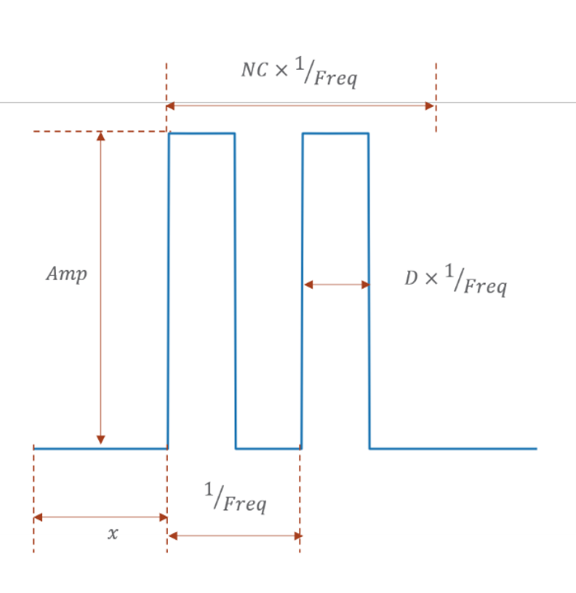
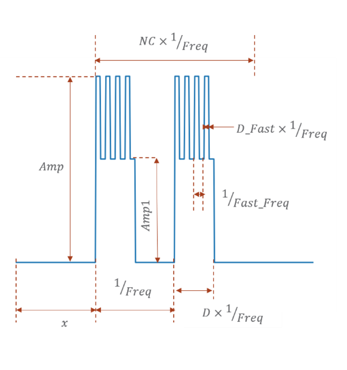
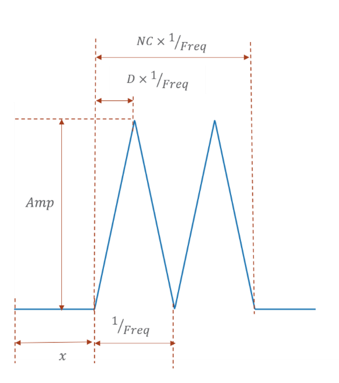
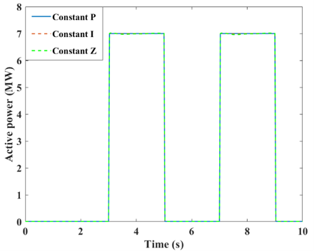
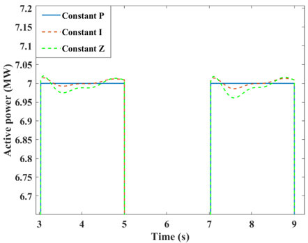
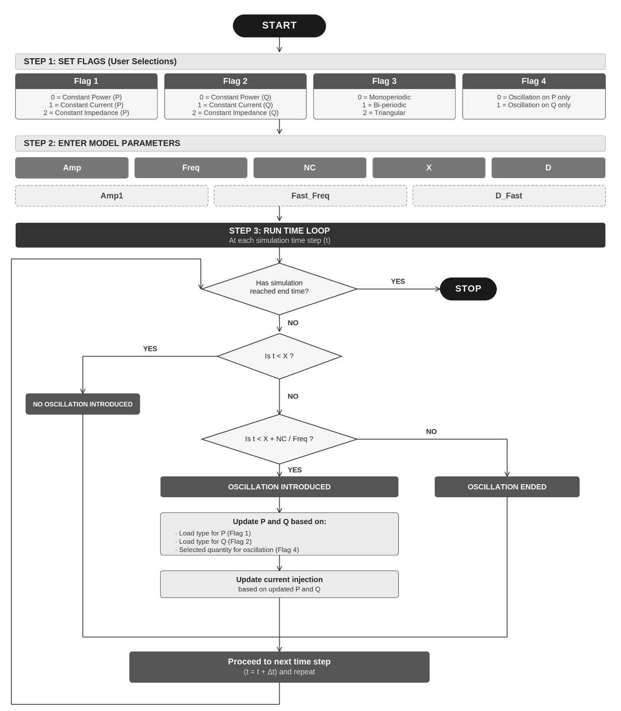

# User-Defined Model: Load Modulation

For questions or to report bugs, please contact: [sameer.nekkalapu@pnnl.gov](mailto:sameer.nekkalapu@pnnl.gov)

---

## Overview

This repository contains a User-Defined Module (UDM) developed for the **PSS/E simulation platform** that modulates the demand of a load based on user-selected signal attributes. The UDM is intended to support transmission planning studies evaluating the impact of **load-induced forced oscillations** on the power grid.

Three versions of the model are available for use in **PSS/E v34, v35, and v36**.

---

## Input Parameters

### Integer Parameters (ICONs)

| ICON | Parameter | Description |
|------|-----------|-------------|
| M | Flag1 | Load type for P: `0` = constant power, `1` = constant current, `2` = constant impedance |
| M+1 | Flag2 | Load type for Q: `0` = constant power, `1` = constant current, `2` = constant impedance |
| M+2 | Flag3 | Waveform type: `0` = monoperiodic, `1` = bi-periodic, `2` = triangular |
| M+3 | Flag4 | Oscillation target: `0` = applied to P only, `1` = applied to Q only |

<br>

### Real Parameters (CONs)

| CON | Parameter | Description |
|-----|-----------|-------------|
| J | X | Start time of the oscillation (s) |
| J+1 | D | Duty cycle |
| J+2 | D_Fast | Duty cycle of faster cycles in bi-periodic waveform *(Flag3 = 1 only)* |
| J+3 | Freq | Frequency of the oscillation (Hz) |
| J+4 | Fast_Freq | Frequency of the faster component in bi-periodic waveform *(Flag3 = 1 only)* |
| J+5 | NC | Number of cycles the oscillation persists |
| J+6 | Amp | Amplitude of the oscillation |
| J+7 | Amp1 | Lower amplitude of fast frequency cycles in bi-periodic waveform *(Flag3 = 1 only)* |

<br>

> **Note:** The parameters `Amp1`, `Fast_Freq`, and `D_Fast` are only active when `Flag3 = 1`.
> However, users should always include default values for these parameters even when `Flag3 = 0`,
> to ensure the DYR file structure is read correctly by PSS/E.

---

## Waveform Modes

The UDM supports three oscillatory load profiles. The figures below illustrate the parametrized representation of each waveform type.

<br>

<p align="center">
  
  <br><br>
  <em>Figure 1(a): Monoperiodic square wave (Flag3 = 0)</em>
</p>

<br>

<p align="center">
  
  <br><br>
  <em>Figure 1(b): Bi-periodic pattern (Flag3 = 1)</em>
</p>

<br>

<p align="center">
  
  <br><br>
  <em>Figure 1(c): Triangular pattern (Flag3 = 2)</em>
</p>

---

## Example Model Response

The figures below show the simulated active power response for different load type representations (constant Z, I, P) under a square wave oscillation.

<br>

<p align="center">
  
  <br><br>
  <em>Figure 2: Comparison of different load type representations for square wave oscillation in active power.</em>
</p>

<br>

<p align="center">
  
  <br><br>
  <em>Figure 3: Zoomed-in representation of Figure 2.</em>
</p>

---

## Usage Flowchart

The flowchart below summarizes the steps for setting up and running the UDM in PSS/E.

<br>

<p align="center">
  
  <br><br>
  <em>Figure 4: Flowchart of the UDM usage.</em>
</p>

---

## Appendix A: Example DYR Entries

### Example A.1 — Bi-periodic oscillation on Q

A load at Bus 1401 with constant-current P and Q components. A bi-periodic oscillation is applied to the Q component with the following settings:

- **Slow component:** 0.25 Hz, peak-to-peak amplitude 7 MVar
- **Fast component:** 1 Hz, peak-to-peak amplitude 3 MVar
- **Start time:** t = 3 s
- **Duration:** 8 cycles of the 0.25 Hz component (32 seconds)
- **Duty cycle:** 0.5 for both components

```
1401 'USRLOD', 'OS', 'LINJBL', 12 1 4 8 0 5 0

  1 1 1 1

  3 0.5 0.5 0.25 1 8 7 3

// Line 2: Flag1  Flag2  Flag3  Flag4
// Line 3: X  D  D_Fast  Freq  Fast_Freq  NC  Amp  Amp1
```

<br>

### Example A.2 — Monoperiodic square wave on P

A load at Bus 1401 with constant-current P and Q components. A monoperiodic square wave oscillation is applied to the P component with the following settings:

- **Frequency:** 0.25 Hz, peak-to-peak amplitude 10 MW
- **Start time:** t = 3 s
- **Duration:** 8 cycles (32 seconds)
- **Duty cycle:** 0.5

```
1401 'USRLOD', 'OS', 'LINJBL', 12 1 4 8 0 5 0

  1 1 0 0

  3 0.5 0 0.25 0 8 10 0

// Line 2: Flag1  Flag2  Flag3  Flag4
// Line 3: X  D  D_Fast  Freq  Fast_Freq  NC  Amp  Amp1
```
